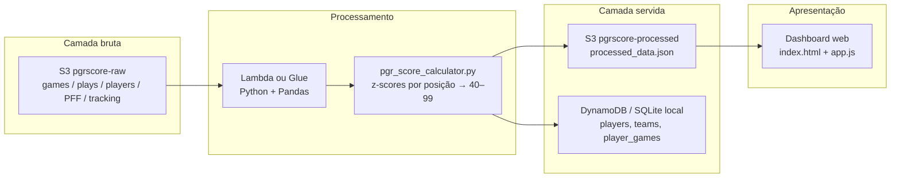

# Arquitetura PGRScore

Pipeline de engenharia de dados NFL: ingestão bruta, cálculo do índice PGRScore em Python e dashboard apenas como camada de apresentação.

## Fluxo

## Componentes

| Etapa | AWS | Simulação local |
| --- | --- | --- |
| Dataset bruto | Bucket `pgrscore-raw` | `data/raw/` |
| Referência de times (nome, cores) | Parâmetro / SSM | `data/ref/teams_2021.json` |
| Campanha W-L-T semanas 1–8 | Resultados oficiais + `games.csv` | `data/raw/game_results.csv` + `pipeline/records.py` |
| Job | Lambda (evento S3) ou Glue Python | `python -m pipeline.run` ou `scripts/aws_s3_upload.py` |
| Métricas PGRScore | Mesmo job | `pipeline/pgr_score_calculator.py` |
| JSON consolidado | `s3://pgrscore-processed/processed/processed_data.json` | `output/processed_data.json` e cópia em `web/` |
| Consultas tabulares | DynamoDB (PK `nfl_id`) | `output/pgrscore.sqlite` |
| Dashboard | CloudFront + S3 estático | `python -m http.server` em `web/` |

## Fontes

- `games.csv`, `plays.csv`, `players.csv`, `pffScoutingData.csv` — Big Data Bowl 2022 (temporada 2021, semanas 1–8).
- `tracking_metrics.json` — overlay de tracking (velocidade, aceleração, jardas/snap, série por jogo). Os arquivos semanais de tracking (~810 MB) não cabem neste repositório; o overlay replica as métricas que o `data.js` original já carregava.
- Snaps = linhas PFF por `nflId`. Pressões = `pff_hit + pff_hurry`. Sacks permitidos (OL) = `pff_sackAllowed`.

## PGRScore

O front-end **não** calcula nota. O índice é um mapeamento logístico 40–99 dos z-scores *dentro do grupo de posição* (QB, RB, WR, TE, OL, DL, LB, DB). Pesos e a curva estão documentados em `pipeline/pgr_score_calculator.py`.

## Ingestão AWS (evento)

`scripts/aws_s3_upload.py` expõe `lambda_handler`. Sem credenciais, o cliente S3 é omitido e os diretórios locais fazem o papel dos buckets.
